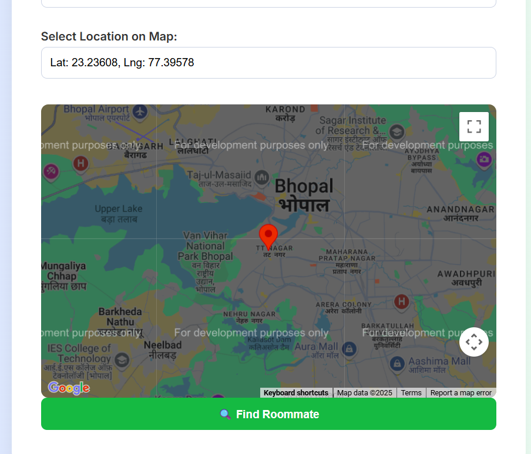

# 🏠 MateMatch | AI-Powered Roommate Matching

[](https://fastapi.tiangolo.com/)
[](https://www.mongodb.com/)
[](https://www.python.org/)

**MateMatch** (formerly Roommate-Dekho) is a modern, data-driven platform designed to help students and professionals find compatible roommates. By analyzing lifestyle preferences, budget alignment, and location intelligence, MateMatch calculates a compatibility score to ensure you find the perfect living partner.

---

## ✨ Key Features

- **🎯 Algorithmic Matching**: Deep analysis of lifestyle data (diet, hobbies, budget) to calculate compatibility scores.
- **📍 Location Intelligence**: Integrated Leaflet.js maps for hyper-local search near your office or university.
- **🚀 FAST Backend**: Powered by FastAPI for high-performance API handling and automatic documentation.
- **🛡️ Data Security**: Pydantic models ensure strict data validation and type safety.
- **📱 Responsive UI**: A premium, glassmorphic design that works beautifully on all devices.
- **🔍 Interactive Docs**: Built-in Swagger UI and Redoc for easy API exploration.

---

## 🛠️ Tech Stack

- **Backend**: FastAPI (Python)
- **Database**: MongoDB Atlas
- **Frontend**: HTML5, Vanilla CSS3, JavaScript
- **Templating**: Jinja2
- **Geo-Services**: Leaflet.js & Geopy
- **ML/Logic**: NumPy (Vectorized Haversine distance calculations)

---

## 🚀 Getting Started

### Prerequisites

- Python 3.9+
- MongoDB Account (or local instance)

### Installation

1. **Clone the repository**:
   ```bash
   git clone https://github.com/aryanitt/MateMatch.git
   cd MateMatch
   ```

2. **Set up Virtual Environment**:
   ```bash
   python -m venv venv
   source venv/Scripts/activate  # On Windows: venv\Scripts\activate
   ```

3. **Install Dependencies**:
   ```bash
   pip install -r requirements.txt
   ```

4. **Environment Configuration**:
   Create a `.env` file (based on `.env.example`) and add your MongoDB connection string.

5. **Run the Application**:
   ```bash
   uvicorn main:app --reload
   ```

6. **Access the Platform**:
   - Web UI: `http://localhost:8000/`
   - Interactive API Docs: `http://localhost:8000/docs`

---

## 📸 Screenshots


*Modern, glassmorphic dashboard for profile creation and matching.*

---

## 📂 Project Structure

```text
MateMatch/
├── main.py            # FastAPI Entry Point
├── models.py          # Pydantic Data Models
├── database.py        # MongoDB Connection Manager
├── matching.py        # ML Matching Algorithm
├── nearloc.py         # Geo-location Distance Logic
├── static/            # CSS, JS, and Assets
├── templates/         # Jinja2 HTML Templates
└── images/            # Uploaded profile photos
```

---

## ⚖️ License

Distributed under the MIT License. See `LICENSE` for more information.

---

### 🌟 Acknowledgments
Built with ❤️ for better shared living experiences.